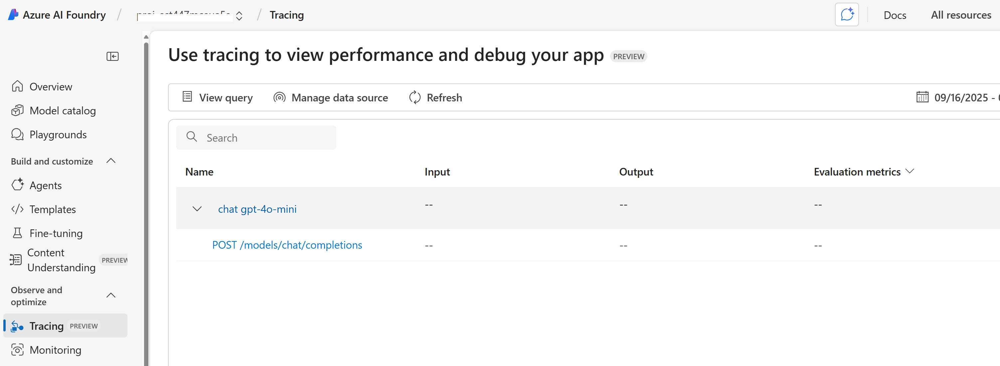

# Other Features

## Tracing and Monitoring

```shell
azd env set ENABLE_AZURE_MONITOR_TRACING true
azd deploy
```

You can view console logs in the Azure portal. You can get the link to the resource group with the azd tool:

```shell
azd show
```

Or if you want to navigate from the Azure portal main page, select your resource group from the 'Recent' list, or by clicking the 'Resource groups' and searching your resource group there.

After accessing your resource group in Azure portal, choose your container app from the list of resources. Then open 'Monitoring' and 'Log Stream'. Choose the 'Application' radio button to view application logs. You can choose between real-time and historical using the corresponding radio buttons. Note that it may take some time for the historical view to be updated with the latest logs.

You can view the App Insights tracing in Azure AI Foundry. Select your project on the Azure AI Foundry page and then click 'Tracing'. 

